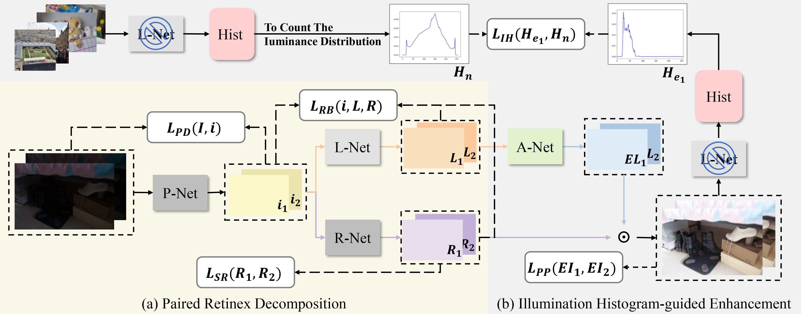

# Differentiable histogram-guided unsupervised Retinex enhancement for paired low-light images
The Pytorch Implementation of DHURE.


## 1 Introduction

This repository is the official implementation of the DHURE, where more implementation details are presented.

## 2 Requirements

```
python = 3.7
pytorch=1.12.0
```

## 3 Dataset Preparation

Refer to the [paired low-light dataset](https://drive.google.com/file/d/1gM3QeNDOCzx0m1gpOoQD1TnGv1BELy08/view) for details.

## 4 Testing

The pretrained model is in the ./weights.

Check the model and image pathes in eval.py, and then run:

```
python eval.py
```

## 5 Training

To train the model, you need to prepare the paired low-light dataset.

Check the dataset path in PRD_main.py and IHE_main.py.

Please note that PRD and IHE are trained separately. First, train PRD, run:
```
python PRD_main.py
```

and then proceed to train IHE, run:
```
python IHE_main.py
```

## 6 Citation

If you find DHURE is useful in your research, please cite our paper:
```
@misc{
anonymous2024differentiable,
title={Differentiable Histogram-Guided Unsupervised Retinex Enhancement for Paired Low-Light Images},
author={Anonymous},
year={2024},
url={https://openreview.net/forum?id=WWDYyqgTZz}
}
```
